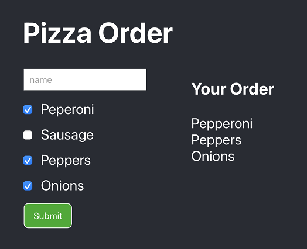

# React Lab 3 

The goal of this lab is to create an order page for a Pizza. Take a look at the picture below and the animated Gif to get an idea of what the app should look like and how it should work. 



You will creating a form with an input and some check boxes. As you enter information and select the check boxes the page should display a summary of the order on the right side. 


## Get started 

- Create a new React App with `npx create-react-app`
- start your app with `yarn start`

## Setting up the form

Don't over think this problem! You can do all of your work in App.js. 

Start by creating the form elements. There is an input, four check boxes, and a button. 

The check boxes should be arranged with a label like this: 

```HTML
<label>
	<input type="checkbox">
	Peperoni
</label>
```

## Using state

Each form element should have a state variable that tracks it's value. 

Start by importing `useState`:

`import { useState } from 'react'`

Then define state for each element. Name will be a string and the checkboxes will be booleans. Define state at the top of your component. 

```JS
const [name, setName] = useState("")
const [peperoni, setPeperoni] = useState(false)
...
```

Connect your components to your state variables. For the checkboxes your state variable will be applied to the `checked property` like this:

```JS
<label>
  <input
    type="checkbox"
    checked={peperoni}
    onChange={() => setPeperoni(!peperoni)}
  />
  Peperoni
</label>
```

Notice the value `peperoni` is assigned to the `checked` property. Noitce that `onChange` calls the setter function `setPeperoni` with the value `!peperoni` which flips the value from true to false or from false to true. 

## Use conditional rendering

Use conditional rendering to display state of the form on the left in the summary area. 

For the name you can just display it. For the ingredient values these are booleans you'll need to use of the conditional rendering patterns. Here is a snippet of code: 

```JS
{peperoni && <div>Pepperoni</div>}
```

Here the `&&` is the and operator. It says the expression is true only if both the left and right side are both true. In this case the left is a boolean and the right side is a component. In JavaScript only certain values are false and all other values are true! So the component on the right is alsways considered true. 

In this arrangement if the value on the left is true then React will display the value on the right. If the value on the left is false React doesn't display anything. 